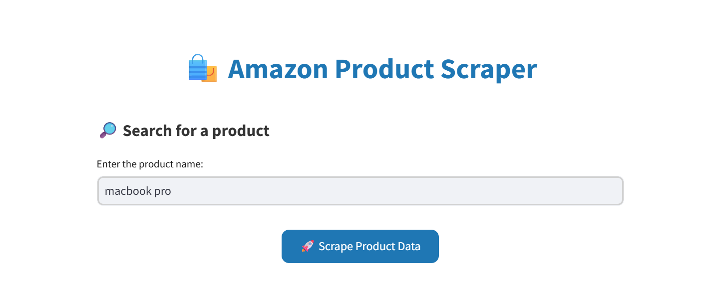
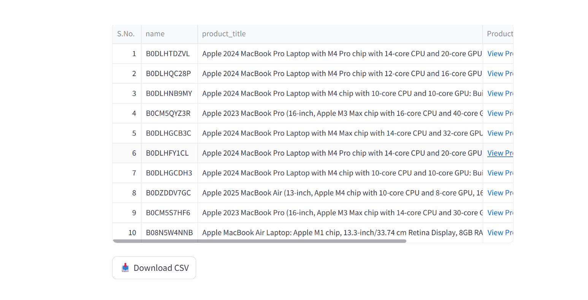
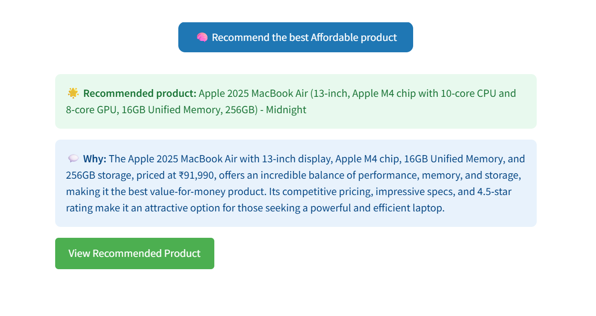

<p align="center">
    <h1 align="center">🛒 AMAZON PRODUCT SCRAPER</h1>
</p>

<p align="center">
    <em>🚀 Intelligent Amazon product scraping with AI-powered insights and beautiful Streamlit interface</em>
</p>

<p align="center">
    
    
    
   
</p>

<p align="center">
    
    
    
    
    
    
</p>

---

## 🎯 Overview

**Amazon Product Scraper** is an intelligent web scraping solution that extracts comprehensive product data from Amazon with AI-powered analysis. Built with a modern Streamlit interface, it combines robust scraping capabilities with intelligent insights to help you gather and analyze Amazon product information efficiently.

### ✨ Key Highlights

- 🤖 **AI-Powered Analysis**: Leverage Groq's LLM for intelligent product insights
- 🎨 **Beautiful UI**: Modern Streamlit interface with responsive design  
- 🛡️ **Anti-Detection**: ScrapeOps proxy integration for reliable scraping
- 📊 **Data Export**: Export results to CSV/Excel formats
- ⚡ **Fast Processing**: Optimized scraping with concurrent requests
- 🔧 **Modular Design**: Clean, maintainable codebase

---

## 🚀 Features

### Core Functionality
- ✅ **Product Information Extraction**: Title, price, ratings, reviews, descriptions
- ✅ **Search Results Scraping**: Bulk product data from search queries
- ✅ **Image URL Collection**: Product images and thumbnails
- ✅ **Review Analysis**: Customer reviews and sentiment analysis
- ✅ **Price Tracking**: Historical price data and trends
- ✅ **Seller Information**: Merchant details and ratings

### Advanced Features
- 🤖 **AI Feedback System**: Intelligent product analysis using Groq LLM
- 📈 **Data Visualization**: Charts and graphs for insights
- 🔄 **Real-time Updates**: Live scraping with progress tracking
- 💾 **Data Persistence**: Save and load scraping sessions
- 🎯 **Smart Filtering**: Advanced search and filter options
- 📱 **Responsive Design**: Works on desktop and mobile

---

## 🛠️ Tech Stack

| Technology | Purpose | Version |
|------------|---------|---------|
|  | Core Language | 3.8+ |
|  | Web Framework | Latest |
|  | HTML Parser | 4.11+ |
|  | HTTP Library | 2.28+ |
|  | Data Analysis | 1.5+ |
|  | LLM Integration | Latest |
|  | Proxy Service | Latest |

---

## 📁 Project Structure

```
Amazon-Product-Scraper/
├── 📁 Agents/
│   └── 🤖 Agent_feedback.py      # AI-powered product analysis
├── 📁 Controllers/
│   └── 🎮 scraper_controller.py  # Main scraping logic
├── 📁 Helpers/
│   ├── ⚙️ config.py             # Configuration settings
│   └── 🛠️ utils.py              # Utility functions
├── 📁 LLM/
│   └── 🧠 groq.py               # Groq LLM integration
├── 📁 Products/
│   └── 📦 product.py            # Product data models
├── 📁 Styles/
│   └── 🎨 style.css             # Custom CSS styling
├── 🚀 app.py                    # Streamlit main application
└── 📋 requirements.txt          # Python dependencies
```

---

## 🏃‍♂️ Quick Start

### Prerequisites

Ensure you have the following installed:

- **Python 3.8+** - [Download Python](https://python.org/downloads/)
- **pip** - Package installer for Python
- **Git** - [Download Git](https://git-scm.com/downloads)

### 🔧 Installation

1. **Clone the repository:**
   ```bash
   git clone https://github.com/Codrecronak/Amazon-Product-Scraper.git
   cd Amazon-Product-Scraper
   ```

2. **Create a virtual environment (recommended):**
   ```bash
   # Windows
   python -m venv venv
   venv\Scripts\activate
   
   # macOS/Linux
   python3 -m venv venv
   source venv/bin/activate
   ```

3. **Install dependencies:**
   ```bash
   pip install -r requirements.txt
   ```

4. **Set up environment variables:**
   ```bash
   # Create .env file in root directory
   echo "GROQ_API_KEY=your_groq_api_key_here" > .env
   echo "SCRAPEOPS_API_KEY=your_scrapeops_api_key_here" >> .env
   ```

### 🎯 Configuration

1. **Get API Keys:**
   - **Groq API**: Visit [Groq Console](https://console.groq.com/) to get your free API key
   - **ScrapeOps API**: Sign up at [ScrapeOps](https://scrapeops.io/) for proxy services

2. **Update config.py:**
   ```python
   # Helpers/config.py
   GROQ_API_KEY = "your-groq-api-key"
   SCRAPEOPS_API_KEY = "your-scrapeops-api-key"
   ```

### 🚀 Usage

1. **Run the application:**
   ```bash
   streamlit run app.py
   ```

2. **Access the app:**
   - Open your browser and navigate to `http://localhost:8501`
   - The Streamlit interface will load automatically

3. **Start scraping:**
   - Enter the product name
   - Click "Scrape product data" and watch the magic happen!

---

## 📱 Demo

### 🎬 Live 
[WATCH VIDEO DEMO HERE](https://youtu.be/GVQFgMIohHs)


### 📸 Screenshots

#### 🏠 Main Dashboard



#### 📊 Data Analysis


#### 🤖 AI Insights  


## 🌐 Live Application

### 🚀 Deployed App
**🔗 [Amazon Product Scraper - Live App](https://your-deployed-app-url.streamlit.app)**


## 🔮 Roadmap

### 🎯 Phase 1 (Current)
- [x] ✅ Basic product scraping
- [x] ✅ Streamlit interface
- [x] ✅ AI integration with Groq
- [x] ✅ CSV export functionality

### 🚀 Phase 2 (In Progress)
- [ ] 🔄 Real-time price monitoring
- [ ] 🔄 Advanced filtering options
- [ ] 🔄 Multi-marketplace support
- [ ] 🔄 API endpoint creation

### 🌟 Phase 3 (Planned)
- [ ] 📈 Advanced analytics dashboard  
- [ ] 🤖 Machine learning price predictions
- [ ] 📱 Mobile app development
- [ ] 🔔 Alert system for price changes

---


## 📄 License

This project is licensed under the **MIT License** - see the [LICENSE](LICENSE) file for details.

```
MIT License - Feel free to use this project for personal and commercial purposes!
```

---

## 🙏 Acknowledgments

### 🌟 Special Thanks

- **[Streamlit Team](https://streamlit.io/)** - For the amazing web framework
- **[Groq](https://groq.com/)** - For lightning-fast LLM inference
- **[ScrapeOps](https://scrapeops.io/)** - For reliable proxy services
- **[Beautiful Soup](https://www.crummy.com/software/BeautifulSoup/)** - For powerful HTML parsing

### 🎨 Design Inspiration

- Modern web scraping tools and dashboards
- Data visualization best practices
- AI-first application design patterns

---

## 📞 Support & Contact

### 🆘 Need Help?

- 📧 **Email**: support@your-domain.com

### 🐛 Report Issues

Found a bug or have a feature request? 
**[Create an Issue](https://github.com/Codrecronak/Amazon-Product-Scraper/issues/new)**

---

<p align="center">
    <strong>⭐ If you found this project helpful, please give it a star! ⭐</strong>
</p>

<p align="center">
    Made with ❤️ by <a href="https://github.com/Codrecronak">Codrecronak</a>
</p>

---

<p align="center">
    
    
    
</p>
